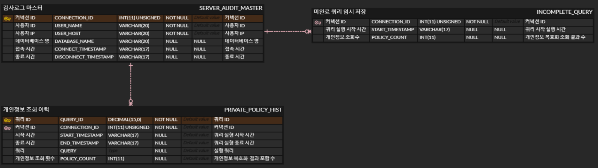
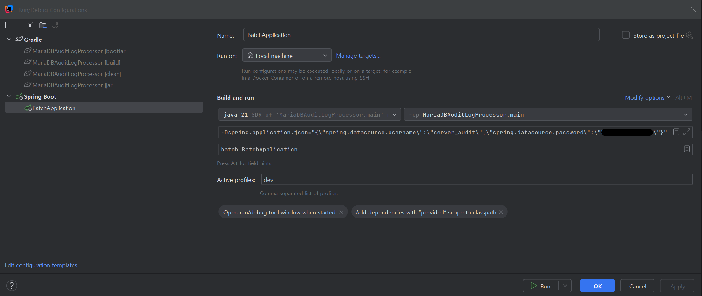

# MariaDB Server Audit Log Processor

#### MariaDB Server Audit Log를 Table에 적재하는 배치 어플리케이션
* Spring boot 3.0.4
* MyBatis Spring boot 3.0.4
* MariaDB Java Client
* Lombok

#### Tables

see : src/main/resources/doc/DDL/SystemAuditLogCreateTable.sql
```SQL
CREATE TABLE SERVER_AUDIT_MASTER (
    CONNECTION_ID INT(11) UNSIGNED NOT NULL COMMENT '커넥션 ID',
    USER_NAME VARCHAR(20) NOT NULL COMMENT '사용자 ID',
    USER_HOST VARCHAR(20) NOT NULL COMMENT '사용자 IP',
    DATABASE_NAME VARCHAR(20) NULL COMMENT '데이터베이스 명',
    CONNECT_TIMESTAMP VARCHAR(17) NULL COMMENT '접속시간',
    DISCONNECT_TIMESTAMP VARCHAR(17) NULL COMMENT '종료시간',
    PRIMARY KEY (CONNECTION_ID)
) COMMENT = 'server audit log master';

/*DROP TABLE IF EXISTS PRIVATE_POLICY_HIST;*/

CREATE TABLE PRIVATE_POLICY_HIST (
    CONNECTION_ID INT(11) UNSIGNED NOT NULL COMMENT '커넥션 ID',
    QUERY_ID DECIMAL(15) NOT NULL COMMENT '쿼리 ID',
    START_TIMESTAMP VARCHAR(17) NULL COMMENT '쿼리 실행 시작 시간',
    END_TIMESTAMP VARCHAR(17) NULL COMMENT '쿼리 실행 종료 시간',
    QUERY TEXT NULL COMMENT '쿼리',
    POLICY_COUNT INT COMMENT '개인정보조회수',
    PRIMARY KEY (CONNECTION_ID, QUERY_ID),
    CONSTRAINT FOREIGN KEY (CONNECTION_ID) REFERENCES SERVER_AUDIT_MASTER (CONNECTION_ID)
) COMMENT='개인정보 조회 이력';

/*DROP TABLE IF EXISTS INCOMPLETE_QUERY;*/

CREATE TABLE INCOMPLETE_QUERY (
    CONNECTION_ID INT(11) UNSIGNED NOT NULL COMMENT '커넥션 ID',
    START_TIMESTAMP VARCHAR(17) NULL COMMENT '쿼리 실행 시작 시간',
    POLICY_COUNT INT COMMENT '개인정보조회수',
    PRIMARY KEY (CONNECTION_ID),
    CONSTRAINT FOREIGN KEY (CONNECTION_ID) REFERENCES SERVER_AUDIT_MASTER (CONNECTION_ID)
) COMMENT='미완료 쿼리 임시 저장';
```
#### Configuration
see
* src/main/resources/application-dev.properties (개발 환경)
* src/main/resources/application-prod.properties (상용 환경)

### 실행

#### Local Development IDE


#### Production - Ubuntu
```shell
$ java -jar -Dspring.profiles.active=prod -Dspring.application.json='{\"spring.datasource.username\":\"server_audit\",\"spring.datasource.password\":\"********\"}' MariaDBAuditLogProcessor.jar
```

### Guides

#### [MariaDB] 보안 취약점 점검 #7 감사 정책 준비
* https://opensrc.tistory.com/261
#### [MariaDB] 보안 취약점 점검 #8 감사 로그 관리
* https://opensrc.tistory.com/264