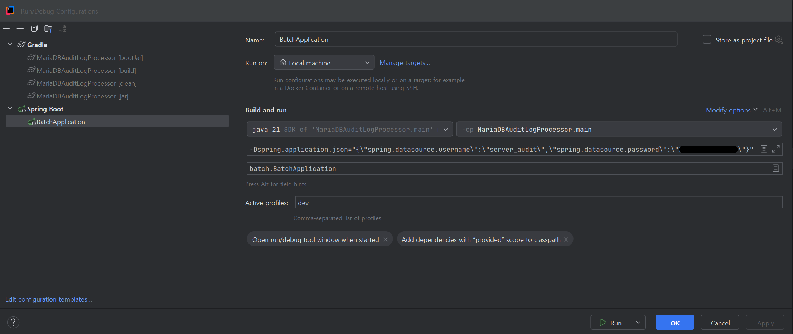

# MariaDB Server Audit Log Processor

#### MariaDB Server Audit Log를 Table에 적재하는 배치 어플리케이션

### 실행

* Local Development IDE

* Production - Ubuntu
  $ java -jar -Dspring.profiles.active=prod -Dspring.application.json='{\"spring.datasource.username\":\"server_audit\",\"spring.datasource.password\":\"BassCraft@!5269\"}' MariaDBAuditLogProcessor.jar

### Guides

#### [MariaDB] 보안 취약점 점검 #7 감사 정책 준비
* https://opensrc.tistory.com/261
